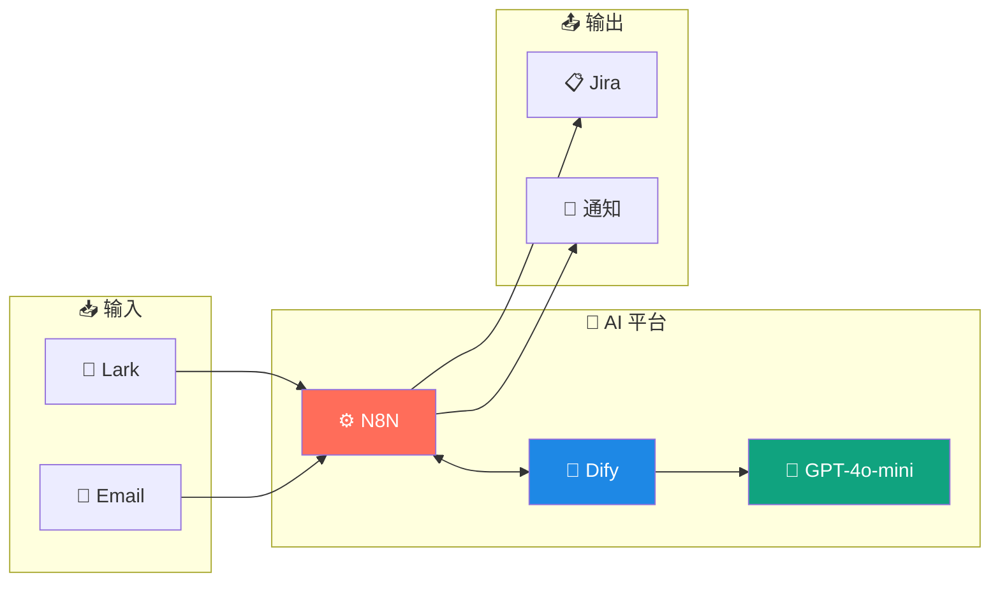

# 🤖 AI 辅助平台技术管理仓库

[](https://opensource.org/licenses/MIT)
[](https://www.docker.com/)
[](https://n8n.io/)
[](https://dify.ai/)

---

## 📋 项目简介

团队内部 **AI 辅助决策平台**，实现运维任务智能化处理。

| 功能模块 | 说明 | 状态 |
|----------|------|------|
| 🔗 **任务收集** | Lark 消息 → AI 分析 → Jira 工单 | 开发中 |
| 🚨 **告警分析** | 邮件告警 → AI 分类 → 知识匹配 → 通知 | 规划中 |
| 📊 **健康评估** | 项目数据 → AI 评估 → 健康报告 | 规划中 |

---

## 🏗️ 技术架构



> 📖 详细架构请参阅 [系统架构设计](docs/architecture/system-architecture.md)

---

## 📁 项目结构

```
ai-platform-technical/
│
├── 📄 README.md                 # 本文件
├── 📄 LICENSE                   # MIT 许可证
│
├── 📂 docs/                     # 📚 设计文档
│   ├── architecture/
│   │   └── system-architecture.md    # 系统架构（含流程图）
│   ├── design/
│   │   ├── module-a-task-collection.md   # 任务收集模块
│   │   ├── module-b-alert-analysis.md    # 告警分析模块
│   │   └── module-c-health-check.md      # 健康度评估模块
│   └── implementation/
│       ├── implementation-plan.md    # 实施计划
│       └── cost-estimation.md        # 成本估算
│
├── 📂 deploy/                   # 🚀 部署配置 (服务化架构)
│   ├── README.md                # 📖 部署总览指南
│   ├── .env.example             # 环境变量模板
│   ├── docker-compose.yml       # 全量服务 Compose
│   ├── deploy-local.ps1/sh      # 本地一键部署脚本
│   ├── shared/                  # 共享基础设施 (Postgres, Redis, Nginx)
│   ├── dify/                    # Dify AI 平台
│   ├── n8n/                     # N8N 工作流引擎
│   └── weaviate/                # 向量数据库
│
├── 📂 config/                   # ⚙️ 配置模板
│   ├── dify/
│   │   └── prompts.md           # Dify Prompt 模板
│   └── n8n/                     # N8N 工作流配置
│
└── 📂 scripts/                  # 🔧 其他工具脚本
```

---

## 🚀 快速开始

### 环境要求

| 要求 | 最低配置 | 推荐配置 |
|------|----------|----------|
| Docker | ✅ 必须 | Docker Desktop |
| 内存 | 8 GB | 16 GB |
| CPU | 4 核 | 8 核 |
| 磁盘 | 20 GB | 50 GB |

### 一键部署（3 步完成）

```powershell
# 1️⃣ 克隆仓库
git clone https://github.com/karl9141/ai-platform-technical.git
cd ai-platform-technical

# 2️⃣ 进入部署目录并配置环境
cd deploy
cp .env.local .env

# 3️⃣ 一键启动
.\deploy-local.ps1              # Windows
# 或
./deploy-local.sh               # Linux/macOS
```

### 访问服务

| 服务 | 地址 | 用途 |
|------|------|------|
| **Dify** | http://localhost:3000 | AI 应用配置 |
| **N8N** | http://localhost:5678 | 工作流管理 |

---

## 📚 文档索引

### 架构设计

| 文档 | 说明 |
|------|------|
| [系统架构设计](docs/architecture/system-architecture.md) | 整体架构、技术选型、流程图 |

### 模块设计

| 文档 | 说明 |
|------|------|
| [任务收集模块](docs/design/module-a-task-collection.md) | Lark → AI → Jira 流程 |
| [告警分析模块](docs/design/module-b-alert-analysis.md) | 邮件告警智能处理 |
| [健康度评估](docs/design/module-c-health-check.md) | 项目健康度 AI 评估 |

### 实施方案

| 文档 | 说明 |
|------|------|
| [实施计划](docs/implementation/implementation-plan.md) | 阶段规划、里程碑 |
| [成本估算](docs/implementation/cost-estimation.md) | 服务器、API 成本 |

### 部署指南

| 文档 | 说明 |
|------|------|
| [全量部署指南](deploy/README.md) | ⭐ 推荐，包含所有服务 |
| [Dify 配置说明](deploy/dify/README.md) | Dify 组件及配置 |
| [N8N 配置说明](deploy/n8n/README.md) | N8N 环境配置 |

---

## 💰 成本概览

| 阶段 | 月成本 | 说明 |
|------|--------|------|
| **MVP 开发期** | ~¥450 | 云端 API |
| **稳定运行期** | ~¥500 | 优化后 |

> 📖 详细成本分析请参阅 [成本估算](docs/implementation/cost-estimation.md)

---

## 🛠️ 技术栈

| 类别 | 技术 | 说明 |
|------|------|------|
| **工作流** | N8N | 开源、可视化、400+ 集成 |
| **AI 平台** | Dify | 开源、RAG、多模型 |
| **LLM** | OpenAI GPT-4o-mini | 日本直连、成本低 |
| **数据库** | PostgreSQL 16 | 共享存储 |
| **缓存** | Redis 7 | 会话缓存 |
| **向量库** | Weaviate | 知识检索 |

---

## 📄 许可证

[MIT License](LICENSE)

---

## 🔗 相关链接

- [GitHub 仓库](https://github.com/karl9141/ai-platform-technical)
- [N8N 官方文档](https://docs.n8n.io/)
- [Dify 官方文档](https://docs.dify.ai/)
