# AI 辅助平台技术管理仓库

[](https://opensource.org/licenses/MIT)

团队内部 AI 辅助平台的完整技术方案，包含架构设计、部署脚本和运维指南。

## 📋 项目概述

本项目构建一套**轻量级、可扩展的 AI 辅助平台**，用于：

- 🔗 **运维任务智能收集** - Lark 消息自动识别、分析、创建 Jira
- 🚨 **告警邮件智能分析** - 告警分类、知识库匹配、处理建议
- 📊 **项目递交健康度评估** - 流程标准化、质量管控（后期）

## 🏗️ 技术架构

```mermaid
flowchart TB
    subgraph External["🌐 外部系统"]
        Lark["💬 Lark"]
        Email["📧 Email"]
        Jira["📋 Jira"]
    end

    subgraph Platform["🏢 AI 辅助平台"]
        N8N["⚙️ N8N<br/>工作流编排"]
        Dify["🤖 Dify<br/>AI 能力平台"]
        OpenAI["🧠 OpenAI<br/>GPT-4o-mini"]
    end

    Lark --> N8N
    Email --> N8N
    N8N <--> Jira
    N8N <--> Dify
    Dify --> OpenAI

    style N8N fill:#ff6d5a,color:#fff
    style Dify fill:#1e88e5,color:#fff
    style OpenAI fill:#10a37f,color:#fff
```



> 详细架构图请参阅 [系统架构设计](docs/architecture/system-architecture.md)

## 📁 项目结构

```
ai-platform-technical/
├── README.md                           # 本文件
├── LICENSE                             # MIT 许可证
│
├── docs/                               # 📚 设计文档
│   ├── architecture/                   # 架构设计
│   │   └── system-architecture.md      # 系统架构设计
│   ├── design/                         # 详细设计
│   │   ├── module-a-task-collection.md # 模块A：任务收集
│   │   ├── module-b-alert-analysis.md  # 模块B：告警分析
│   │   └── module-c-health-check.md    # 模块C：健康度评估
│   └── implementation/                 # 实施方案
│       ├── implementation-plan.md      # 实施计划
│       └── cost-estimation.md          # 成本估算
│
├── deploy/                             # 🚀 部署脚本
│   ├── n8n/                            # N8N 部署
│   │   ├── docker/                     # Docker 部署
│   │   └── k8s/                        # Kubernetes 部署
│   ├── dify/                           # Dify 部署
│   │   ├── docker/                     # Docker 部署
│   │   └── k8s/                        # Kubernetes 部署
│   └── infrastructure/                 # 基础设施
│       └── docker-compose.yml          # 一键部署全套环境
│
├── config/                             # ⚙️ 配置模板
│   ├── n8n/                            # N8N 工作流模板
│   └── dify/                           # Dify Prompt 模板
│
└── scripts/                            # 🔧 工具脚本
    ├── setup.sh                        # 环境初始化
    └── backup.sh                       # 数据备份
```

## 🚀 快速开始

### 环境要求

- Docker & Docker Compose
- 4GB+ 内存
- 网络可访问 OpenAI API（或本地部署 Ollama）

### 一键部署（开发环境）

```bash
cd deploy/infrastructure
docker-compose up -d
```

访问：
- N8N: http://localhost:5678
- Dify: http://localhost:3000

### AWS EKS 部署

详见 [N8N K8s 部署指南](deploy/n8n/k8s/README.md) 和 [Dify K8s 部署指南](deploy/dify/k8s/README.md)

## 📚 文档索引

| 文档 | 说明 |
|------|------|
| [系统架构设计](docs/architecture/system-architecture.md) | 整体架构、技术选型、组件说明 |
| [任务收集模块设计](docs/design/module-a-task-collection.md) | 模块 A 详细设计 |
| [告警分析模块设计](docs/design/module-b-alert-analysis.md) | 模块 B 详细设计 |
| [实施计划](docs/implementation/implementation-plan.md) | 阶段规划、里程碑 |
| [成本估算](docs/implementation/cost-estimation.md) | 服务器、API 成本 |

## 💰 成本估算

| 阶段 | 月成本 |
|------|--------|
| MVP（OpenAI API） | ~¥450 |
| 成熟期（本地模型） | ~¥800 |

## 🛠️ 技术栈

| 组件 | 技术 | 说明 |
|------|------|------|
| 工作流引擎 | N8N | 开源、可视化、400+ 集成 |
| AI 平台 | Dify | 开源、RAG、多模型支持 |
| LLM | OpenAI / Ollama | 云端或本地部署 |
| 数据库 | PostgreSQL | 共享存储 |
| 消息 | Lark Bot | 企业协作 |
| 工单 | Jira API | 任务管理 |

## 📄 License

MIT License
