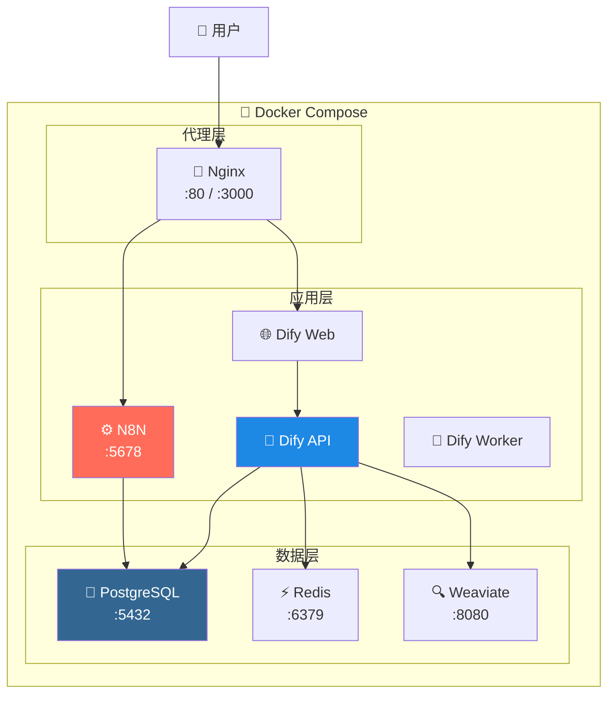

# 🚀 AI Platform 一键部署指南

---

## 📋 概述

本目录提供 **生产级一键部署方案**，包含完整的 AI 辅助平台环境。

---

## 🏗️ 部署架构



---

## 📁 目录结构

```
deploy/infrastructure/
│
├── 📄 docker-compose.yml    # 主配置文件
├── 📄 .env.example          # 环境变量模板
├── 📄 .env                  # 环境变量（自动生成）
│
├── 📄 deploy.ps1            # Windows 部署脚本
├── 📄 deploy.sh             # Linux/macOS 部署脚本
├── 📄 README.md             # 本文件
│
├── 📂 init-scripts/         # 数据库初始化
│   └── 01-init-db.sql
│
├── 📂 nginx/                # Nginx 配置
│   ├── nginx.conf
│   └── conf.d/
│       └── default.conf
│
├── 📂 n8n/                  # N8N 配置
│   └── workflows/           # 工作流备份
│
└── 📂 backup/               # 数据备份
```

---

## 🚀 一键部署

### Windows

```powershell
cd deploy\infrastructure
.\deploy.ps1
```

### Linux / macOS

```bash
cd deploy/infrastructure
chmod +x deploy.sh
./deploy.sh
```

---

## 📊 服务清单

| 服务 | 端口 | 用途 | 健康检查 |
|------|------|------|----------|
| **PostgreSQL** | 5432 | 数据存储 | ✅ |
| **Redis** | 6379 | 缓存队列 | ✅ |
| **Weaviate** | 8080 | 向量数据库 | ✅ |
| **N8N** | 5678 | 工作流引擎 | ✅ |
| **Dify API** | 5001 | AI 后端 | ✅ |
| **Dify Worker** | - | 后台任务 | - |
| **Dify Web** | 3000 | 前端界面 | ✅ |
| **Nginx** | 80/3000 | 反向代理 | ✅ |

---

## 🔧 运维命令

### 快捷命令

| 操作 | Windows | Linux/macOS |
|------|---------|-------------|
| **启动** | `.\deploy.ps1 -Action start` | `./deploy.sh start` |
| **停止** | `.\deploy.ps1 -Action stop` | `./deploy.sh stop` |
| **重启** | `.\deploy.ps1 -Action restart` | `./deploy.sh restart` |
| **状态** | `.\deploy.ps1 -Action status` | `./deploy.sh status` |
| **日志** | `.\deploy.ps1 -Action logs` | `./deploy.sh logs` |
| **备份** | `.\deploy.ps1 -Action backup` | `./deploy.sh backup` |
| **清理** | `.\deploy.ps1 -Action clean` | `./deploy.sh clean` |

### Docker 命令

```bash
# 查看所有容器状态
docker ps

# 查看单个服务日志
docker logs -f ai-platform-n8n

# 进入容器
docker exec -it ai-platform-postgres psql -U postgres

# 重启单个服务
docker restart ai-platform-dify-api
```

---

## ⚙️ 配置说明

### 环境变量

编辑 `.env` 文件修改配置：

```bash
# 数据库密码
POSTGRES_PASSWORD=你的安全密码

# Redis 密码
REDIS_PASSWORD=你的安全密码

# N8N 密钥
N8N_ENCRYPTION_KEY=32位加密密钥

# Dify 密钥
DIFY_SECRET_KEY=sk-32位密钥

# 时区
TIMEZONE=Asia/Tokyo
```

### 首次部署

部署脚本会自动：
1. 复制 `.env.example` 到 `.env`
2. 生成随机安全密钥
3. 拉取 Docker 镜像
4. 启动所有服务

---

## 💻 资源需求

### 最低配置

| 资源 | 要求 |
|------|------|
| **内存** | 8 GB |
| **CPU** | 4 核 |
| **磁盘** | 20 GB |

### 推荐配置

| 资源 | 要求 |
|------|------|
| **内存** | 16 GB |
| **CPU** | 8 核 |
| **磁盘** | 50 GB |

### 服务内存分配

| 服务 | 内存限制 |
|------|----------|
| PostgreSQL | 512 MB |
| Redis | 256 MB |
| Weaviate | 1 GB |
| N8N | 1 GB |
| Dify API | 2 GB |
| Dify Worker | 1 GB |
| Dify Web | 512 MB |
| Nginx | 128 MB |
| **总计** | **~6.5 GB** |

---

## ✅ 生产级特性

### 1. 健康检查

```yaml
healthcheck:
  test: ["CMD", "curl", "-f", "http://localhost:5001/health"]
  interval: 30s
  timeout: 10s
  retries: 3
```

### 2. 资源限制

```yaml
deploy:
  resources:
    limits:
      memory: 2G
    reservations:
      memory: 1G
```

### 3. 日志轮转

```yaml
logging:
  driver: "json-file"
  options:
    max-size: "50m"
    max-file: "5"
```

### 4. 自动重启

```yaml
restart: unless-stopped
```

### 5. 依赖管理

```yaml
depends_on:
  postgres:
    condition: service_healthy
```

---

## 💾 备份恢复

### 创建备份

```bash
# 使用脚本
./deploy.sh backup

# 手动备份数据库
docker exec ai-platform-postgres pg_dumpall -U postgres > backup.sql
```

### 恢复数据

```bash
cat backup.sql | docker exec -i ai-platform-postgres psql -U postgres
```

---

## 🔍 故障排查

### 常见问题

| 问题 | 原因 | 解决方案 |
|------|------|----------|
| 端口被占用 | 其他服务占用 | 修改 `.env` 端口 |
| 内存不足 | Docker 限制 | 增加 Docker 内存 |
| 启动失败 | 依赖未就绪 | 等待后重试 |
| 网络错误 | 网络冲突 | `docker network prune` |

### 查看日志

```bash
# 全部日志
docker-compose logs -f

# 单个服务
docker logs -f ai-platform-n8n
docker logs -f ai-platform-dify-api
docker logs -f ai-platform-postgres
```

---

## 🔄 升级流程

```bash
# 1. 备份数据
./deploy.sh backup

# 2. 拉取新镜像
docker-compose pull

# 3. 重新部署
docker-compose up -d

# 4. 验证服务
./deploy.sh status
```

---

## 🌐 访问地址

| 服务 | URL | 说明 |
|------|-----|------|
| **N8N** | http://localhost:5678 | 工作流管理 |
| **Dify** | http://localhost:3000 | AI 应用平台 |

---

## 📝 首次使用

### 1. 配置 Dify

1. 访问 http://localhost:3000
2. 创建管理员账户
3. 进入 **设置 → 模型供应商**
4. 添加 OpenAI API Key

### 2. 配置 N8N

1. 访问 http://localhost:5678
2. 创建账户
3. 开始创建工作流
