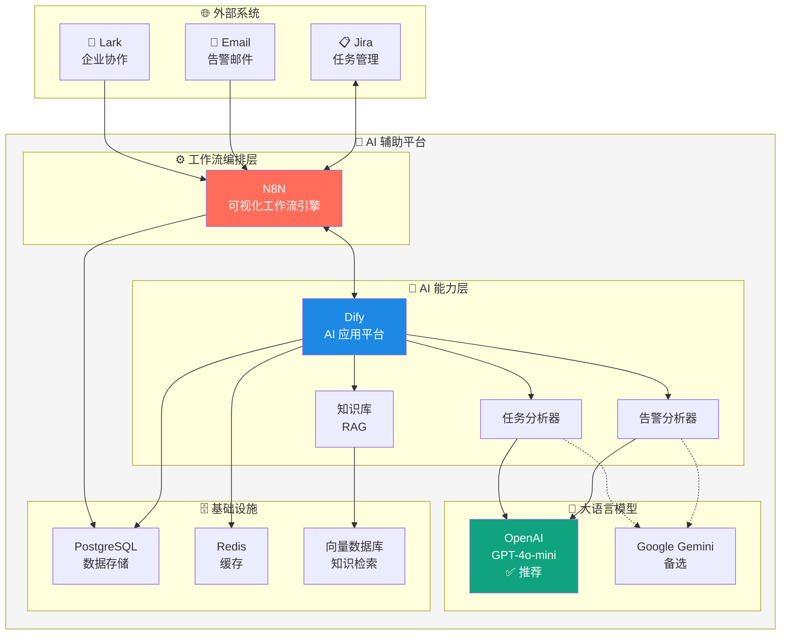
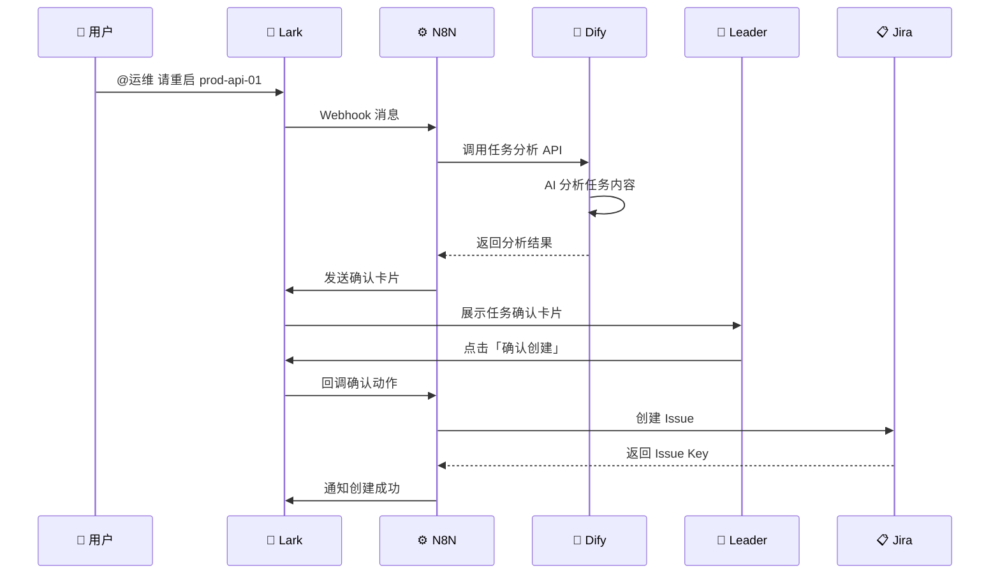
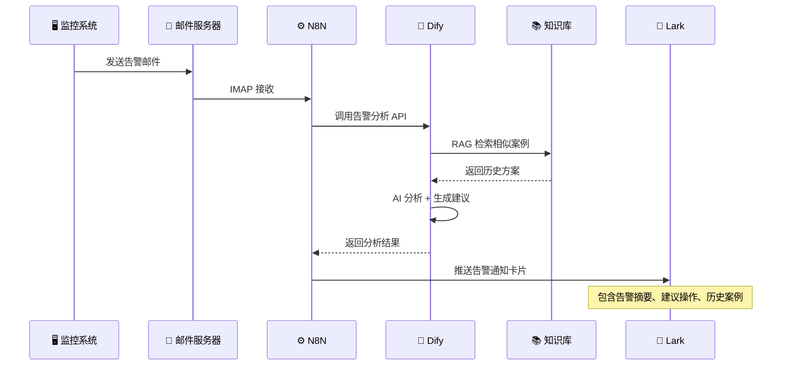
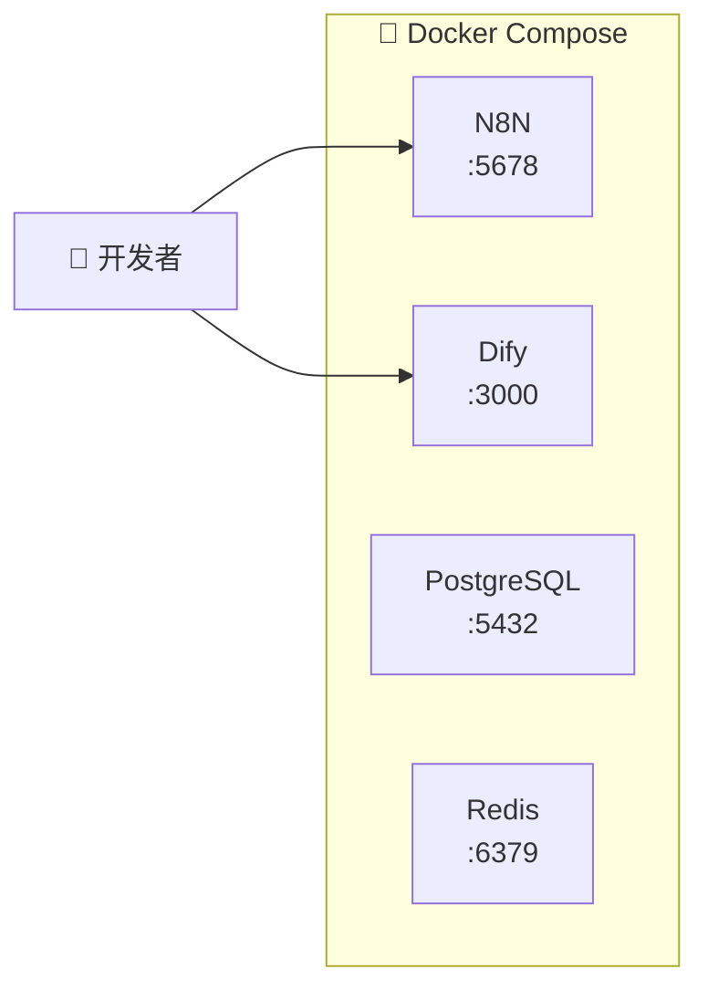
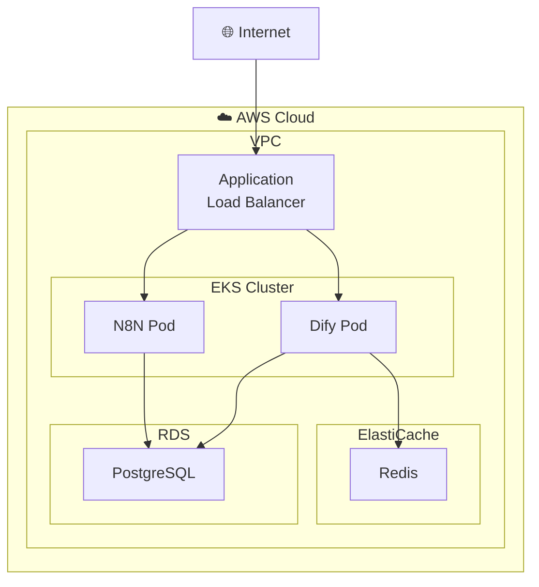
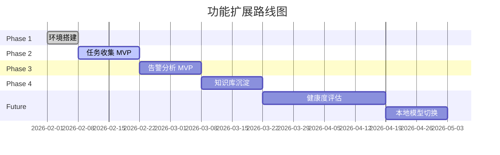

# 系统架构设计

## 1. 架构概述

本平台采用分层架构设计，实现事件驱动的 AI 辅助决策系统。

- **设计理念**：AI 辅助决策，人工最终确认
- **核心价值**：提升运维效率，沉淀知识资产
- **技术路线**：开源优先，云端 API + 自托管

---

## 2. 系统架构图

---

## 3. 业务流程图

### 3.1 运维任务收集流程

### 3.2 告警邮件分析流程

---

## 4. 分层架构说明

### 4.1 事件入口层

| 组件 | 协议 | 职责 | 状态 |
|------|------|------|------|
| Lark Webhook | HTTPS | 接收群消息、交互卡片回调 | ✅ 已集成 |
| Email IMAP | IMAP/SMTP | 接收告警邮件、发送回复 | ✅ 已集成 |
| Jira Webhook | HTTPS | 状态变更通知 | ✅ 已集成 |

### 4.2 工作流编排层 (N8N)

| 工作流 | 触发方式 | 功能 |
|--------|----------|------|
| 任务收集 | Lark Webhook | Lark 消息 → AI 分析 → 确认 → Jira |
| 告警处理 | Email IMAP | 告警邮件 → AI 分析 → 多渠道分发 |
| 健康度评估 | 定时触发 | 数据采集 → 评估 → 报告生成 |

### 4.3 AI 能力层 (Dify)

| 应用 | 功能 | 模型 |
|------|------|------|
| 任务分析器 | 识别任务、提取信息、生成建议 | GPT-4o-mini |
| 告警分析器 | 告警分类、知识库匹配、建议生成 | GPT-4o-mini |
| 知识库 | RAG 检索历史案例 | 向量数据库 |

### 4.4 基础设施层

| 组件 | 用途 | 部署方式 |
|------|------|----------|
| PostgreSQL 16 | 共享数据库（N8N、Dify） | Docker / RDS |
| Redis 7 | 会话缓存、限流 | Docker / ElastiCache |
| 向量数据库 | 知识库存储 | Dify 内置 |

---

## 5. 技术选型

### 5.1 核心组件

| 类别 | 选型 | 版本 | 选型理由 |
|------|------|------|----------|
| 工作流引擎 | **N8N** | latest | 开源、可视化、400+ 集成 |
| AI 应用平台 | **Dify** | latest | 开源、RAG 内置、多模型支持 |
| 数据库 | **PostgreSQL** | 16 | 稳定、与组件兼容性好 |

### 5.2 LLM 选型（日本地区）

| 模型 | 推荐度 | 价格 | 说明 |
|------|--------|------|------|
| ✅ **OpenAI GPT-4o-mini** | ⭐⭐⭐⭐⭐ | $0.15/1M | **首选**，日本直连稳定 |
| ✅ Google Gemini Pro | ⭐⭐⭐⭐ | $0.125/1M | 备选，东京数据中心 |
| ⚠️ 通义千问/文心一言 | ⭐ | - | 不推荐，需大陆身份验证 |

> **注意**：当前方案使用云端 API（OpenAI GPT-4o-mini），后期可根据需要切换至本地模型。

---

## 6. 部署架构

### 6.1 开发环境

### 6.2 生产环境 (AWS)

---

## 7. 安全设计

| 安全措施 | 说明 |
|----------|------|
| 🔐 传输加密 | 所有 API 通信使用 HTTPS |
| 🔒 敏感信息脱敏 | 发送给 LLM 前脱敏客户信息 |
| 📝 审计日志 | 所有 AI 决策过程可追溯 |
| 🛡️ 访问控制 | N8N/Dify 仅内网访问 + 认证 |

---

## 8. 扩展路线图

