# 系统架构设计

**文档版本**: v2.0  
**更新日期**: 2026-02-01  
**状态**: 已评审  

---

## 1. 执行摘要

本平台是一套**轻量级、可扩展的 AI 辅助决策系统**，采用事件驱动架构，实现运维任务智能化处理。

| 核心价值 | 说明 |
|----------|------|
| 🎯 **提升效率** | 自动分析任务/告警，减少人工判断时间 |
| 🧠 **知识沉淀** | RAG 知识库持续积累，降低人员依赖 |
| ✅ **质量保障** | AI 辅助 + 人工确认，确保决策准确性 |

---

## 2. 系统全景架构

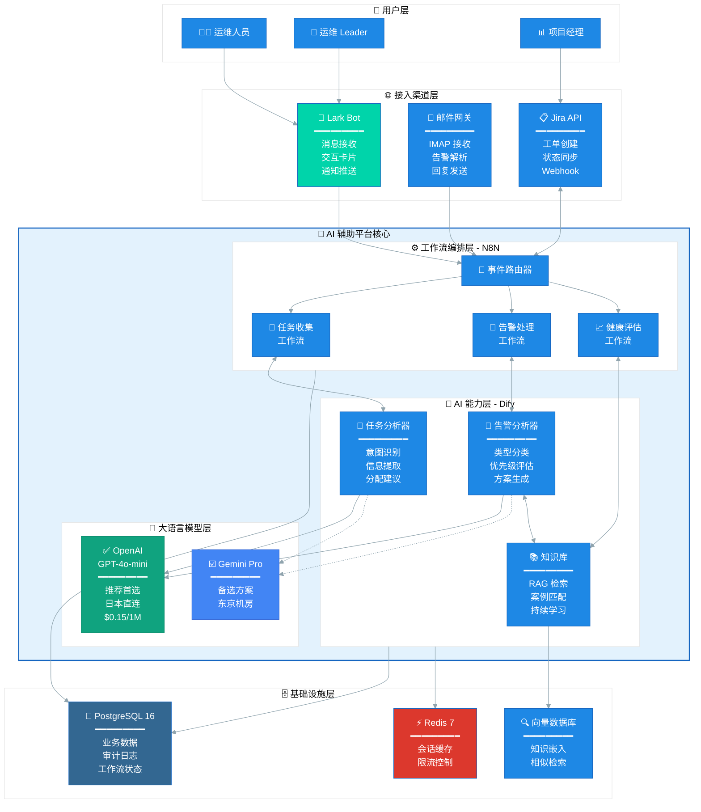

---

## 3. 分层架构详解

### 3.1 接入渠道层

负责接收外部事件，提供用户交互入口。

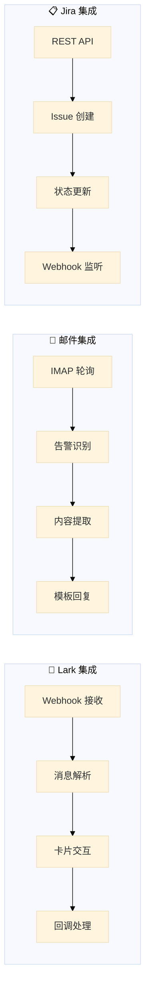

| 渠道 | 协议 | 功能 | SLA |
|------|------|------|-----|
| **Lark** | HTTPS Webhook | 消息接收、卡片交互、通知推送 | < 3s |
| **Email** | IMAP/SMTP | 告警接收、内容解析、回复发送 | < 30s |
| **Jira** | REST API | 工单 CRUD、状态同步 | < 5s |

### 3.2 工作流编排层 (N8N)

可视化工作流引擎，负责流程编排和系统集成。

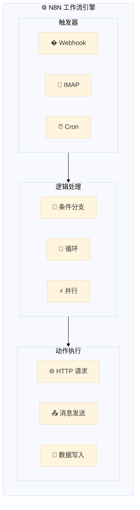

| 工作流 | 触发方式 | 处理步骤 | 输出 |
|--------|----------|----------|------|
| **任务收集** | Lark @触发 | 消息解析 → AI分析 → 确认卡片 → Jira创建 | Jira Issue |
| **告警处理** | 邮件接收 | 告警解析 → AI分类 → 知识匹配 → 多渠道通知 | 通知 + 工单 |
| **健康评估** | 定时触发 | 数据采集 → 指标计算 → AI评估 → 报告生成 | 健康报告 |

### 3.3 AI 能力层 (Dify)

AI 应用开发平台，提供 LLM 调用、RAG 检索、Prompt 管理。

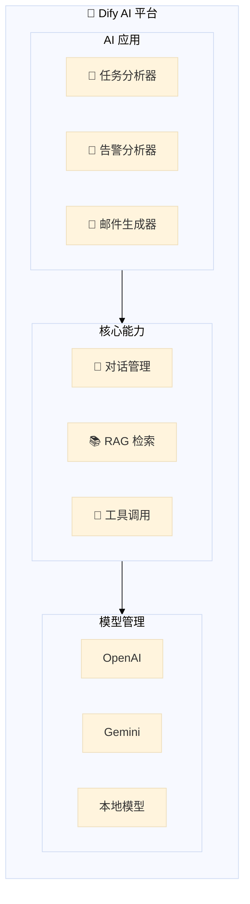

| 应用 | 输入 | 输出 | 模型 |
|------|------|------|------|
| **任务分析器** | Lark 消息文本 | 任务 JSON（系统/目的/紧急度） | GPT-4o-mini |
| **告警分析器** | 告警邮件内容 | 分类 + 建议 + 历史案例 | GPT-4o-mini + RAG |
| **邮件生成器** | 告警摘要 | 客户回复模板 | GPT-4o-mini |

### 3.4 基础设施层

数据存储和计算资源。

| 组件 | 版本 | 用途 | 部署方式 |
|------|------|------|----------|
| **PostgreSQL** | 16 | 业务数据、审计日志、工作流状态 | Docker / RDS |
| **Redis** | 7 | 会话缓存、限流、队列 | Docker / ElastiCache |
| **向量数据库** | Weaviate | 知识嵌入、相似检索 | Dify 内置 |

---

## 4. LLM 选型决策

### 4.1 推荐方案（日本地区）

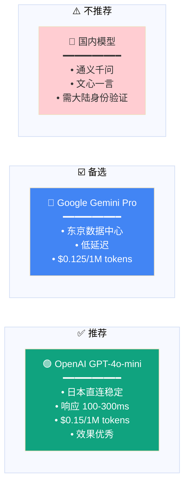

### 4.2 选型对比

| 维度 | OpenAI GPT-4o-mini | Gemini Pro | 国内模型 |
|------|-------------------|------------|----------|
| **网络** | ✅ 日本直连 | ✅ 东京机房 | ❌ 需验证 |
| **延迟** | 100-300ms | 80-200ms | 不适用 |
| **价格** | $0.15/1M | $0.125/1M | - |
| **效果** | ⭐⭐⭐⭐⭐ | ⭐⭐⭐⭐ | - |
| **推荐度** | ⭐⭐⭐⭐⭐ | ⭐⭐⭐⭐ | ⭐ |

---

## 5. 业务流程设计

### 5.1 运维任务收集流程

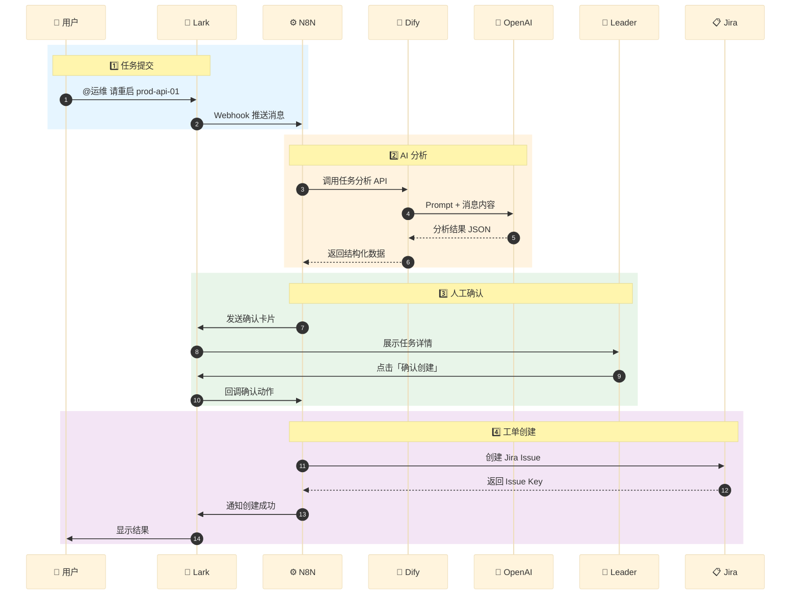

### 5.2 告警处理流程

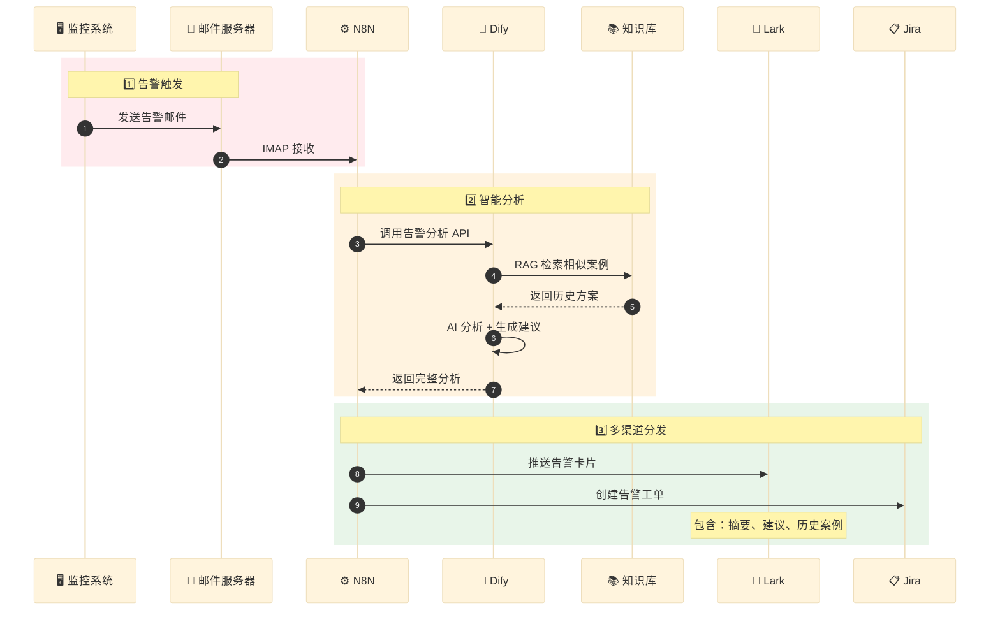

---

## 6. 部署架构

### 6.1 开发环境 (Docker Compose)

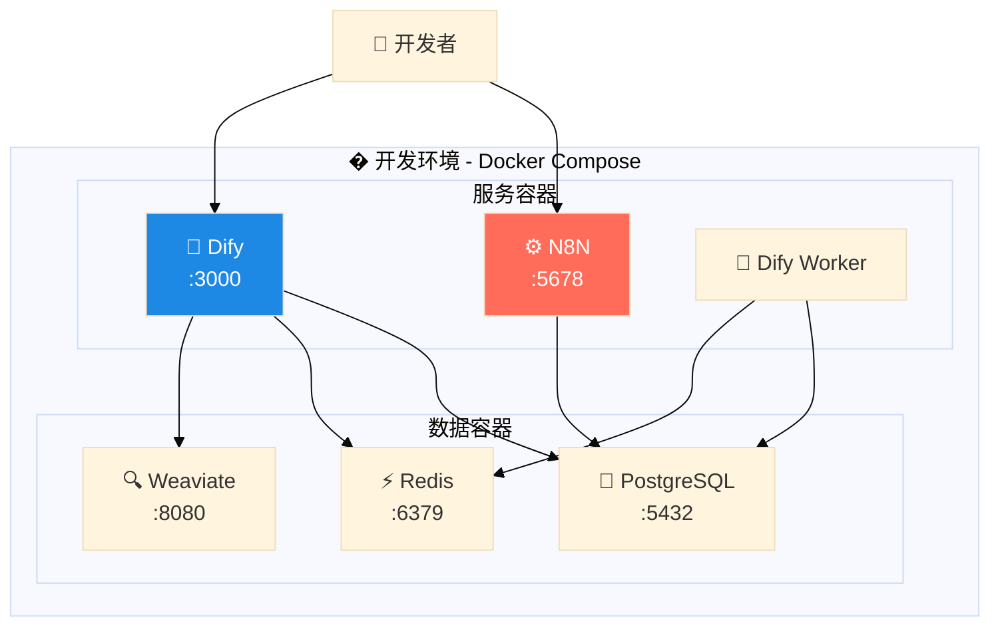

### 6.2 生产环境 (AWS EKS)

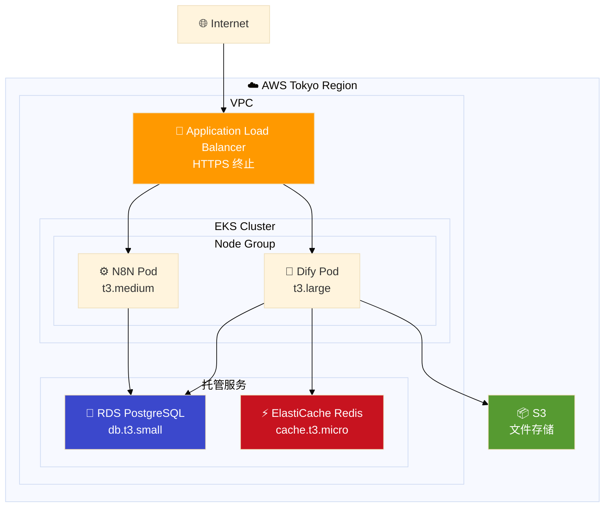

---

## 7. 安全架构

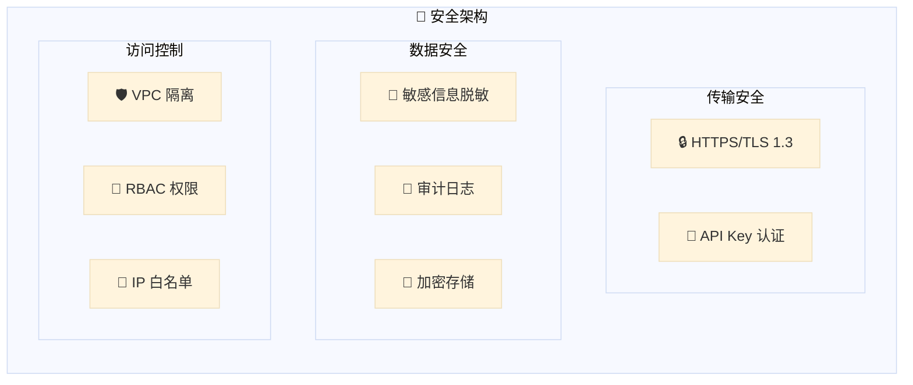

| 安全层 | 措施 | 说明 |
|--------|------|------|
| **传输** | TLS 1.3 | 所有 API 通信加密 |
| **认证** | API Key + OAuth | Dify/N8N 访问控制 |
| **数据** | 脱敏处理 | LLM 调用前移除敏感信息 |
| **审计** | 完整日志 | 所有 AI 决策可追溯 |
| **网络** | VPC + SG | 内网隔离，最小权限 |

---

## 8. 扩展路线图

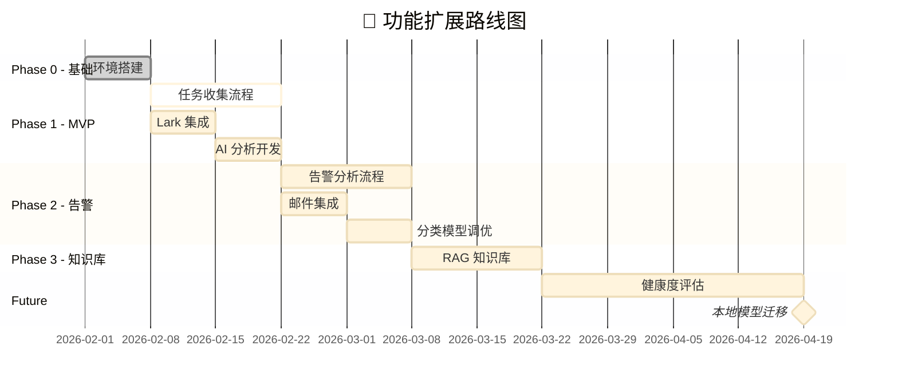

---

## 附录

### A. 技术栈版本

| 组件 | 版本 | 许可证 |
|------|------|--------|
| N8N | latest | Fair-code |
| Dify | latest | Apache 2.0 |
| PostgreSQL | 16 | PostgreSQL |
| Redis | 7 | BSD |
| Docker | 24+ | Apache 2.0 |

### B. 相关文档

- [任务收集模块设计](../design/module-a-task-collection.md)
- [告警分析模块设计](../design/module-b-alert-analysis.md)
- [实施计划](../implementation/implementation-plan.md)
- [成本估算](../implementation/cost-estimation.md)
